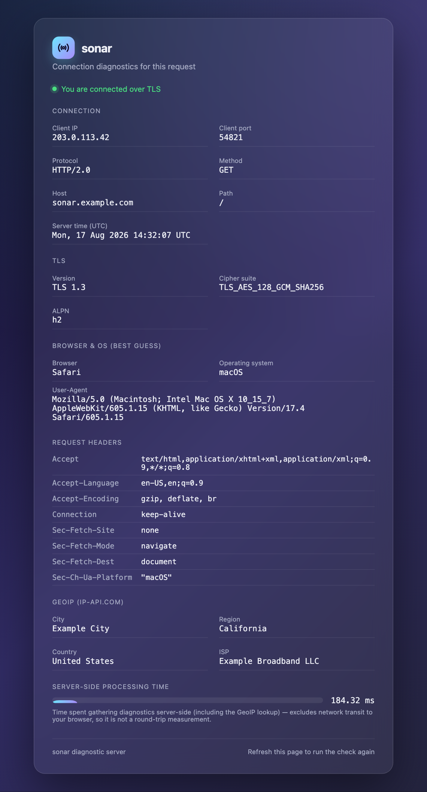
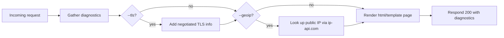
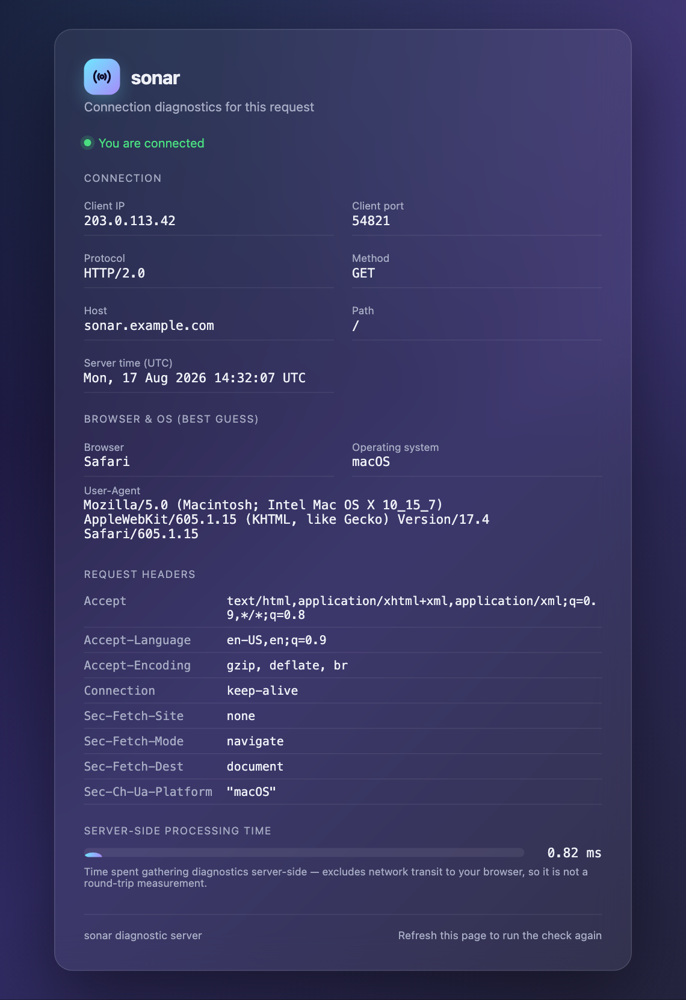

# sonar

[](go.mod)
[](LICENSE)
[](go.mod)

A lightweight Go diagnostic web server. It responds to **every** HTTP
request — any method, any path — with a single page showing exactly what
the server can see about your connection: client IP/port, protocol, TLS
details, request headers, a best-guess browser/OS, and server-side
processing time.

Useful for quickly verifying connectivity, checking what a client's
request looks like from the server side, debugging reverse proxies and
load balancers, or testing TLS termination.

<p align="center">
  
</p>

<p align="center"><sub>Example output — all values above are fabricated for illustration; sonar never ships with sample data.</sub></p>

## Why sonar

- **Zero dependencies.** Standard library only — a small, auditable
  binary you can trust to sit in front of real traffic.
- **Nothing touches disk.** TLS certificates are generated in memory at
  startup and never written out, even temporarily.
- **Quiet by default.** No outbound network calls unless you explicitly
  opt in with `--geoip`.
- **XSS-safe by construction.** Every request-derived value (headers,
  User-Agent, path) is rendered through `html/template`, never
  concatenated into raw HTML.
- **One binary, no service.** Installers drop a single executable in
  `$HOME/.local/bin`; nothing is registered to run in the background.

## How a request becomes a page



Private and loopback addresses are always skipped for GeoIP, and a
lookup failure never fails the request — the section is simply omitted.

## Install

**Ubuntu:**
```sh
curl -fsSL https://raw.githubusercontent.com/davewat/sonar/main/scripts/install-ubuntu.sh | sh
```

**macOS:**
```sh
curl -fsSL https://raw.githubusercontent.com/davewat/sonar/main/scripts/install-macos.sh | sh
```

Each installer ensures a Go toolchain is available, builds the `sonar`
binary from source, installs it to `$HOME/.local/bin` by default — no
sudo required — and deletes all build artifacts, leaving only the binary.
No background service is registered; you run `sonar` yourself.

Override the install location with `SONAR_INSTALL_DIR` (e.g. to install to
a shared system path like `/usr/local/bin` instead — that will fall back
to `sudo` if needed). If `$HOME/.local/bin` isn't already on your `PATH`,
the installer prints the line to add to your shell profile.

`sudo` cannot prompt for a password when a script is read from a pipe. If
the one-liner fails because it needs a password, download and run it
locally instead:
```sh
curl -fsSL https://raw.githubusercontent.com/davewat/sonar/main/scripts/install-ubuntu.sh -o install-ubuntu.sh
sh install-ubuntu.sh
```
(macOS: install-macos.sh also requires Homebrew to already be installed, if Go isn't already present — the script won't try to install Homebrew itself.)

## Build from source

```sh
go build -o sonar ./cmd/sonar
```

No third-party dependencies — standard library only.

## Usage

```sh
sonar --help
sonar                          # HTTP on port 443 (needs root/setcap — see below)
sonar --port 8080              # HTTP on an unprivileged port
sonar --port 8443 --tls        # HTTPS with an in-memory self-signed certificate
sonar --port 8080 --geoip      # HTTP with outbound GeoIP lookups enabled
```

Flags:

| Flag       | Default | Description |
|------------|---------|-------------|
| `--port`   | `443`   | Port to listen on. |
| `--tls`    | `false` | Serve HTTPS using an in-memory, self-signed certificate generated at startup. Never written to disk. |
| `--geoip`  | `false` | Enable outbound GeoIP lookups (ip-api.com) to show country/region/city/ISP for the visitor's public IP. |

<p align="center">
  
</p>

### Privileged ports

Ports below 1024 (including the default, 443) require elevated privileges
on Linux and macOS. If `sonar` can't bind, it prints a clear error rather
than a raw Go stack trace. Options:

```sh
sudo sonar --port 443
sudo setcap 'cap_net_bind_service=+ep' "$(which sonar)"   # Linux; better long-term than running as root
sonar --port 8443                                          # or just use an unprivileged port
```

### TLS

`--tls` generates a fresh ECDSA P-256 self-signed certificate in memory
every time `sonar` starts — nothing is ever written to disk. Because it's
self-signed, every browser will show an untrusted-certificate warning; this
is expected and must be clicked through.

### GeoIP

`--geoip` is off by default — with it off, sonar makes no outbound network
calls at all. When enabled, it queries the free `ip-api.com` endpoint
(no API key) for the visitor's public IP, skipping private/loopback
addresses entirely. That endpoint is HTTP-only and rate-limited to roughly
45 requests/minute on the free tier; lookup failures are non-fatal and
simply omit the GeoIP section from the page.

### Reverse proxies

`sonar` reports the client IP from the raw TCP connection (`RemoteAddr`),
not from `X-Forwarded-For` — if you put sonar behind a reverse proxy,
you'll see the proxy's address. `X-Forwarded-For` is shown informationally
in the headers table (it's attacker-spoofable, so it's never trusted for
the reported client IP).

## Project layout

```
cmd/sonar/           entrypoint (flags, startup, listener/TLS wiring)
internal/server/      HTTP handler, diagnostics gathering, in-memory TLS cert, GeoIP, page template
internal/server/web/  the diagnostic page template (embedded via go:embed)
scripts/               install-ubuntu.sh, install-macos.sh
```

`internal/` is a Go compiler-enforced convention: packages under it can only
be imported from within this module, which is appropriate here since
`server` is sonar's private implementation, not a reusable library.

## License

MIT — see [LICENSE](LICENSE).
